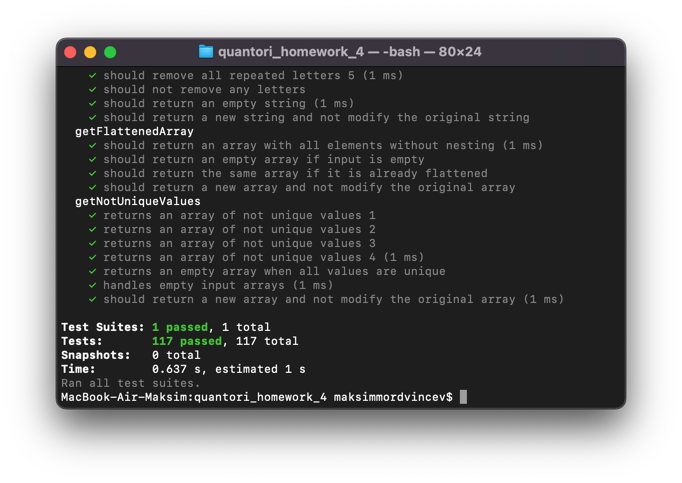

# Quantori Homework #4

### Introduction to JS

**All exercises have been completed and checked using the Jest testing library.**

To run the tests yourself, it is required:

1. Download all files from repo (feature branch) to your local;

2. Run command in terminal from project folder to install all node modules:

```shell
npm i
```

3. Run command to start tests:

```shell
npm test
```

**More information about solutions and tests presented in the documentation.**

---

## <a name="content">Content</a>

1. [Task](#Task)
2. [Solutions](#solutions)
   1. [Exercises](#solutions-exercises)
   2. [Tests](#solutions-tests)
2. [Branches](#branches)
3. [Contacts](#contacts)

---

## <a name="Task">Task</a>

- [X] Complete 23 tasks from the file.

---


## <a name="solutions">Solutions</a>

For the correct solving of all exercises,
conditions were set under which the task would be considered successfully completed:

- The function returns the required value from the example;
- The function works correctly with boundary values;
- The function works correctly with empty values ([] or "");
- The function works correctly when changing the order of numbers (for array) or when changing the case of letters (for string), etc;
- The function should be pure - the input values should not change after using the function.

To fulfill all the criteria, more than 100 autotests have been developed using the Jest library, 
which check all the necessary conditions.

### <a name="solutions-exercises">Exercises</a>

For some functions, no conditions were set for specific values. 
Therefore, it was decided to develop various exceptions and perform some additional checks.

Learn more about the various solutions:

---

#### Exercises 2-3

In these exercises, the `.reduce()` method was used, since `Math.min()` must be used in the next functions.

---

#### Exercises 4

The task says that it is necessary to leave strings **shorter** than 20 characters. 
Therefore, it was decided that a string of exactly 20 characters in length would not remain in the array.

Example:

```javascript
//input:
const strings = ['20 characters 20 cha'];

//output
const expected = [];
```

---

#### Exercises 7

If we use `Math.min` or `Math.max` on an empty array with the spread operator, 
then it will return us Infinity:

```javascript
console.log(Math.min(...[])); // Infinity
console.log(Math.max(...[])); // -Infinity
```

Therefore, it was decided to check the length of the array before searching for the required value. 
In case of an empty array, `undefined` is returned

**Example:**
```javascript
...
    return numbers.length > 0 ? Math.min(...numbers) : undefined
...
```

---

#### Exercises 13

There are situations when a person does not have a patronymic or does not want to give a surname. 
Therefore, instead of simply concatenating the fields, it was decided to check for their existence:

```javascript
    return 'Name: '
        + (user.firstName ? user.firstName + ' ' : '')
        + (user.patronymic ? user.patronymic + ' ' : '')
        + (user.secondName ? user.secondName : '')
```

---

#### Exercises 19

Before counting vowels in string, it is necessary to change string register so that such problems do not occur:

```javascript
['a', 'e', 'i', 'o', 'u'].includes(['A']) //false
```

**Example:**

```javascript
[...string.toLowerCase()]...
```

---

#### All Exercises

In order for the function to be pure and not change the input data, it is necessary to monitor the methods used.

`.map()` method does not modify the array, but returns a new one. Therefore, it can be used: 

```javascript
return numbers.map(row => Math.min(...row))
```

But `.sort()` modify original array, therefore it is necessary to use the spread operator:

```javascript
return [...numbers].sort...
```

---

### <a name="solutions-tests">Tests</a>

All tests are presented in the `tests/functions.test.js` file.

**Almost every test checks the conditions:**
- Example values;
- Empty values;
- Boundary Values;
- Function is pure.

All implemented tests were successfully passed:



---

## <a name="branches">Branches</a>

**Description:** A branch with solved tasks and Jest autotests.

To run the tests yourself, it is required:

1. Download all files from repo to your local;

2. Run command in terminal from project folder to install all node modules:

```shell
npm i
```

3. Run command to start tests:

```shell
npm test
```

---

## <a name="contacts">Contacts</a>

**TG**: [@mordvintsevmv](https://t.me/mordvintsevmv)

**e-mail**: mordvintsevmv@gmail.com


[🔝Content🔝](#content)
